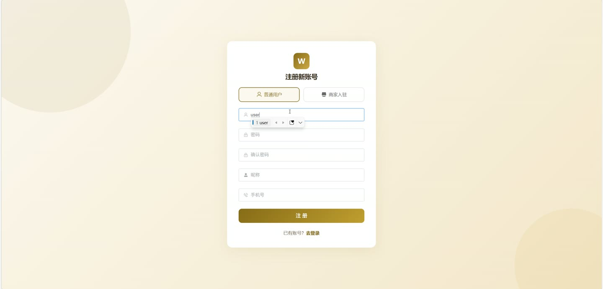
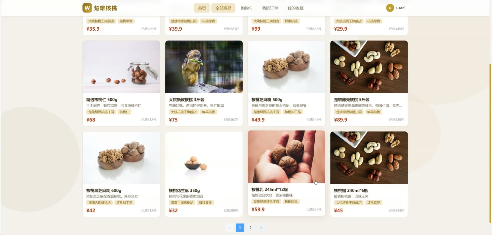
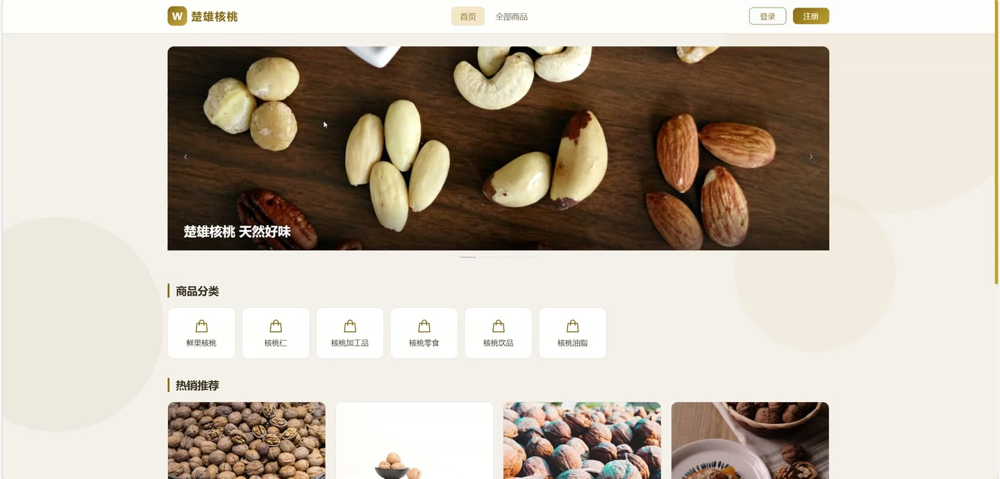
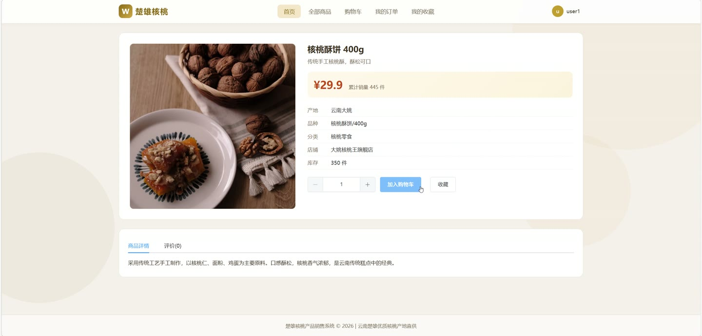
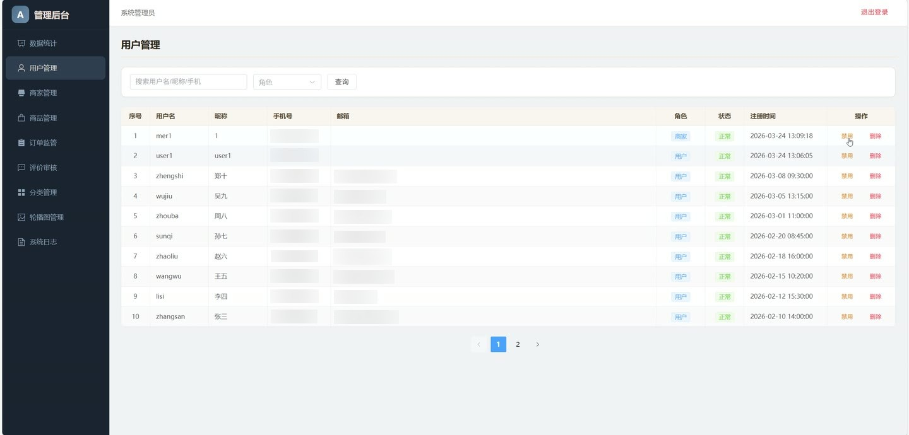
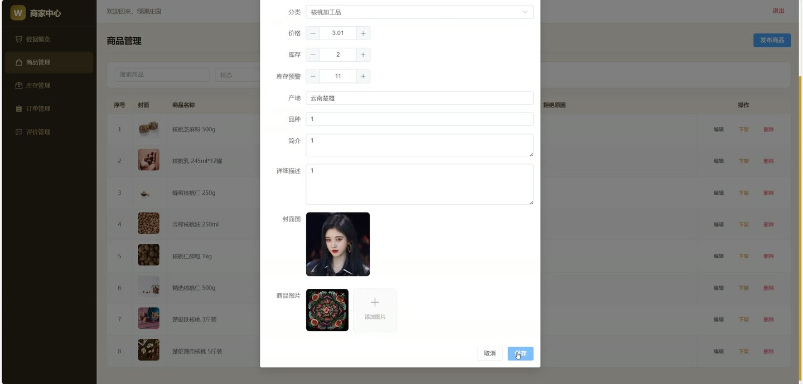

# (附文档)Springboot3+Vue3+MySQL 核桃产品销售系统

**技术栈**：Springboot3、Vue3、MySQL

### 系统简介

本系统是一个基于 Spring Boot 3 + Vue 3 前后端分离的核桃产品销售平台，支持普通用户、商家、管理员三种角色。普通用户可以浏览商品、管理购物车、下单支付、评价收藏；商家可以管理商品库存、处理订单、回复评价；管理员负责用户管理、商家入驻审核、商品审核、订单监管、评价审核、分类与轮播图配置及系统日志查看。
 
### 核心功能
 
### 普通用户端

 
- 用户注册与登录：支持用户名密码注册/登录，注册时可选择普通用户或商家入驻类型 
- 商品浏览：查看商品分页列表，支持按关键词搜索、按分类筛选、按商家筛选、按价格排序 
- 商品详情：查看商品名称、价格、库存、描述、详情、产地、品种、封面图及多张商品图片 
- 商品评价：查看已审核通过的商品评价列表（含评分、内容、图片、回复） 
- 购物车管理：添加商品到购物车、修改数量（受库存限制）、切换选中状态、删除单条或批量删除 
- 订单管理：从购物车选中项创建订单、模拟支付、取消订单、确认收货、申请退款 
- 个人资料：修改昵称、手机号、邮箱、头像；修改密码（需验证原密码） 
- 收货地址：新增/编辑/删除地址，设置默认地址 
- 商品收藏：收藏/取消收藏商品，查看收藏列表，检查某商品是否已收藏 
- 发表评价：对已收货订单中的商品发表评价，填写评分、文字内容并上传多张图片 
- 商家入驻申请：提交店铺名称、联系方式、地址、描述，等待管理员审核
 
### 商家端

 
- 商品管理：查看本店商品列表（支持按名称/状态筛选）、发布新商品、编辑商品信息 
- 商品上下架：将商品设为下架或提交审核上架（上架需管理员审核） 
- 商品图片管理：发布/编辑时上传多张图片，按排序顺序展示 
- 库存管理：手动入库（增加库存）、手动出库（减少库存）、盘点调整库存，记录每次变动原因 
- 库存预警：查看库存低于预警阈值的在售商品列表 
- 库存变动日志：查看指定商品的入库/出库/调整历史记录 
- 订单管理：查看本店订单列表（支持按状态/订单号筛选）、查看订单详情 
- 发货处理：填写物流单号进行发货操作 
- 退款处理：查看用户退款申请，可选择通过退款或驳回退款 
- 评价管理：查看本店商品的所有评价（含用户昵称、商品名称、评分、图片），回复评价 
- 销售统计：查看本店的总订单数、总销售额、各状态订单数量等统计数据
 
### 管理员端

 
- 用户管理：查看所有非管理员用户列表（支持按用户名/昵称/手机号搜索、按角色筛选）、启用/禁用用户、删除用户 
- 商家入驻审核：查看商家入驻申请列表（按状态筛选）、审核通过或拒绝（拒绝需填写原因），通过后自动升级用户角色为商家 
- 商品审核：查看所有商品列表（支持按名称搜索、按状态筛选）、审核通过或拒绝商品上架（拒绝需填写原因） 
- 订单监管：查看全平台订单列表（支持按状态/订单号筛选）、查看订单详情 
- 评价审核：查看所有评价列表（支持按状态筛选）、审核通过/隐藏评价、删除评价 
- 商品分类管理：新增/编辑/删除商品分类，分类下存在商品时禁止删除 
- 轮播图管理：新增/编辑/删除首页轮播图，支持排序 
- 系统日志：查看操作日志列表（支持按操作内容/用户名搜索） 
- 平台数据统计：查看全平台订单总数、总销售额、各状态订单数量等统计数据
 
### 技术栈

 后端框架Spring Boot 3 ORMMyBatis-Plus 权限Spring Security + JWT 前端框架Vue 3 状态管理Pinia 构建工具Vite 数据库MySQL
 
### 交付内容

 
- 后端完整源码 
- 前端完整源码 
- 数据库初始化脚本 
- 万字文档

## 界面展示

---

## 获取完整源码 + 万字文档

本仓库为项目介绍页。**完整前后端源码、数据库初始化脚本、万字项目文档**，请加微信 `kangkangcode`，或访问 [codekk.top](http://codekk.top) 获取。

可作课程设计 / 毕业设计参考，支持远程部署调试。